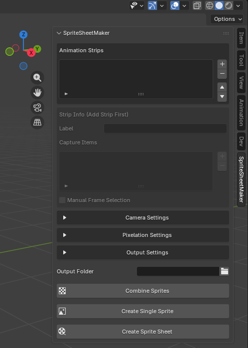
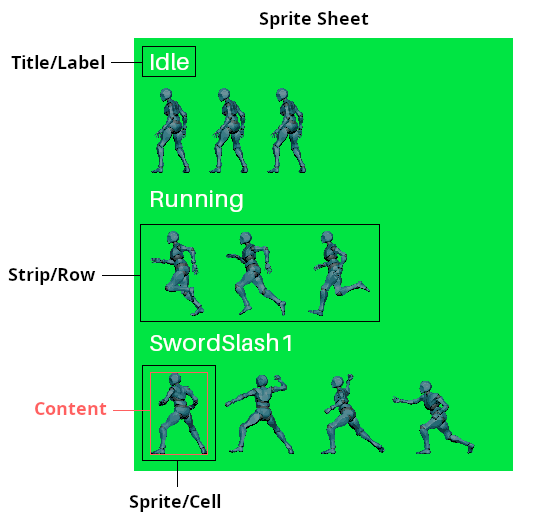
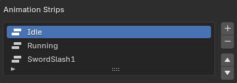
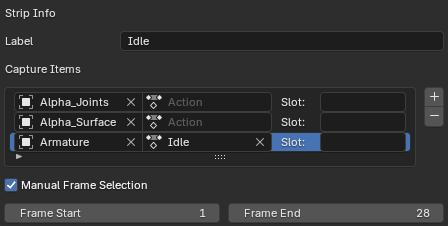
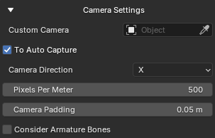
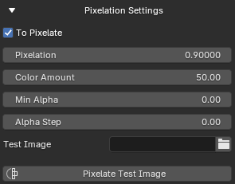
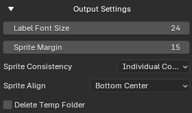
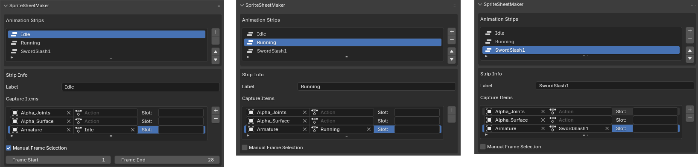

# 🖼️ Sprite Sheet Maker


An addon to convert your 3D animations into 2D sprite sheets with in-built toggleable pixelation


>📜 Tip:  
> For only the core functionality and not the UI take a look at these files:  
> 1. `modules/combine_frames.py`  
> 1. `modules/sprite_sheet_maker_utils.py`  
> 
> _If you use these in your own project feel free to leave a ⭐_


## 🪄 Features
1. Highly customizable
2. Inbuilt auto camera
3. Labeling for each strip
4. Allows single sprite creation
5. In-built pixelation tool
6. Recontinuing in case of failure  


## 🛠️ How to install?
1. Download this repo as .zip file (or download from [releases](https://github.com/ManasMakde/SpriteSheetMaker/releases/))
2. Go to _Edit -> Preferences -> Add-ons -> Install from Disk_ and select the .zip file (make sure it's enabled once installed)
3. If the installation was successful you should now see the panel changed as such:

     


## 📖 Terminology  
  


## 🧭 Usage
1. **Animation Strips:**   
      

   Each one of these represent a row within a sprite sheet, You can add or remove them using the + and - buttons on the side, You can reorder them using the arrow ▲ and ▼ buttons on the side.

2. **Strip Info:**  
      

   This shows the properties of whichever strip is selected in `Animation Strips`, If it is grayed out & disabled then it mean you have to add a strip first

   1. **Label:**  
      This is the text that will be added on top of the strip in the sprite sheet

   2. **Capture Items:**  
      These are all the objects that will be captured within a single strip, Use + and - buttons on the side to add & remove items. Once an item is created it will have 3 inputs:  
      `Object` This refers to the object that should be captured  
      `Action` This refers to what action the aforementioned object should be playing  
      `Slot` This refers to [action slot](https://www.youtube.com/watch?v=N4GlTIz66EA) to be used (leave blank if you're unsure)  

      The benefit of this system is that it also allows you to capture 2 different characters within the same strip

   3. **Manual Frame Selection:**  
      If this is enabled you can manually set the Start & End frames (inclusive) for the strip, If this is disabled then the start & end frame of longest duration action will be taken

3. **Camera Settings**  
      

   1. **Custom Camera:**  
      If provided this camera will be used to capture images
   
   2. **To Auto Capture:**  
      If checked then the `Custom Camera` will be automatically setup for you, If `Custom Camera` is not provided then a camera will be created, setup & deleted afterwards. If unchecked then you will have to setup the camera yourself e.g. Keep all objects in frame, Follow them as they move, etc

   3. **Camera Direction:**  
      Which direction should the camera be facing from while capturing sprites

   4. **Pixels Per Meter:**  
      How many pixels each meter translates to in your sprite sheet (Don't use this for pixelation it will give blurry images, Look at `Pixelation Amount` instead)

   5. **Camera Padding:**  
      Amount of padding to keep around the view of the camera

   6. **Consider Armature Bones:**  
      If this is enabled then the bones of the armature(s) are also taken into calculations when fitting the objects into view of camera 

4. **Pixelation Settings**  
      

   1. **To Pixelate:**  
      If this is unchecked the entire process of pixelation will be skipped
      
   2. **Pixelation Amount:**  
      By what factor to pixelate the sprites, Higher the value the more the sprites will be pixelated

   3. **Pixelation Color Amount:**   
      This controls the "Value" in HSV color of the sprite

   4. **Min Alpha:**  
      If any pixel in the sprite has a transparency less than this amount then it is discarded (If you would like to remove all semi-transparent pixel set this to 1.0)

   5. **Alpha Step:**  
      Ensures that all pixels have a transparency which is a multiple of this amount

   6. **Shrink Interp:**  
      Which interpolation method to use while shrinking the rendered image into pixelated version

   7. **Test Image:**  
      Provide an image on which to apply the pixelation settings (useful for testing pixelation settings before applying to entire sheet)

   8. **Pixelate Test Image:**  
      Generates a pixelated version of the image provided, This is purely for testing purposes on the provided image, this button will not effect your sprite sheet in any way (You can also think of this as a standalone pixelizer for images)

5. **Output Settings**  
      

   1. **Label Font Size:**  
      The font size of the action name labels in sprite sheet, If you do not want labels in your sprite sheet you can set it to 0

   2. **Sprite Margin:**  
      Margin, in pixels, that should be applied around each sprite
   
   3. **Sprite Consistency:**  
      This dictates the dimension of sprites,  
      `Individual Consistent` means each sprite keeps to its own content's width while matching the height of its row i.e. All sprites have their own dimensions  
      `Row Consistent` means every sprite in the row matches the row's widest sprite in width and tallest sprite in height i.e. All sprites in a row have the same dimensions  
      `All Consistent` means every sprite in the sheet matches the widest sprite in width and tallest sprite in height i.e. All sprites have the same dimensions  
   
   4. **Sprite Align:**  
      Decides how the content should be aligned within the sprite
   
   5. **Delete Temp Folder:**  
      Should the temp folder be deleted after creating the sprite sheet (Look at "How this works?" section to learn more)


6. **Output Folder:**  
   Folder in which the sprite sheet is rendered

7. **Combine Sprites:**  
   Combines all images in the selected `Output Folder` into one sprite sheet but only given that it follows the following structure:

   ```
   SpriteSheetMakerTemp/
   ├── 0_Idle/
   │   ├── 1.png
   │   └── 2.png
   ├── 1_Running/
   │   ├── 1.png
   │   └── 2.png
   └── 2_Attacking/
      ├── 1.png
      └── 2.png
   ```

8. **Create Single Sprite:**  
   This renders a single sprite with all settings applied, Only `Actions to Capture` is ignored and instead generates sprite in whatever is currently in the viewport

9. **Create Sprite Sheet:**  
   This creates the entire sprite sheet at the specified `Output Folder`, While creating you might see a temp folder by the name of "SpriteSheetMakerTemp" do not delete it otherwise the sheet won't be created properly 


## 🗺️ Example
Here's an example of what values inside strips should look like (Using mixamo Y-bot):  
   

Typically in `Capture Items` add all your meshes with no action (unless specifically required) and add your armatures with actions, In the above example you can see the Idle animation will only be 28 frames long i.e. only have 28 sprites in it's strip

The reason meshes were also added was so that `To Auto Capture` also puts them within view of camera instead of only the armature


## ❓ Common Questions
**_Why is my sprite empty / not showing any objects?_**  
1. Make sure you've added the desired objects to `Objects to Capture`
2. Make sure `Pixels Per Meter` isn't 0 or too small 
3. Make sure you've added lights  
4. Make sure if `Auto Camera` is unchecked your own camera is setup properly
5. Try rendering on your own before using this addon to see if the issue persists  

<br/>

**_Why do strips contain the same or invalid animation?_**  
Make sure you have assigned the correct actions & slots in "Capture Items" for all strips

<br/>

**_Why is my content improperly cut off?_**  
Make sure you have assigned the correct objects in "Capture Items" for all strips

<br/>

**_Why is "Create Single Sprite" changing the poses of objects & armatures?_**  
This is not an addon issue it's just how Blender works while rendering, Try unlinking the actions from the objects & armatures first then create the single sprite

<br/>

**_Why is Blender crashing when I try to create a sprite sheet?_**  
1. You might be trying to render an image that is too big i.e. the value of `Pixels Per Meter` is too high or you're trying to capture a really big object with too much resolution, Try rendering without the plugin first to see if the issue still persists
2. You might be trying to render too many frames and your system might not be able to handle it

<br/>

**_How do I see the progress of sprite sheet creation?_**  
You need to open Blender via [console](https://www.youtube.com/watch?v=ijngHwCoDQo) where you can see exactly what the plugin is currently doing

<br/>

**_Why isn't the background transparent?_**  
1. This is not a plugin issue, you have to manually set it in `Render Properties > Film > Transparent` and enable it as shown [here](https://www.youtube.com/watch?v=kgqvS69_X98)
2. Make sure Output `Properties > Color` is set to RGBA & that `File Format` is .png 

<br/>

**_How to recontinue interrupted rendering of sprite sheet?_**  
1. Locate the incomplete "SpriteMakerTemp" folder (or whichever folder you were rendering your sprite frames into) and see which actions have not rendered all frames or are missing
2. Then add those missing/incomplete actions to `Actions to Capture` and uncheck the `Delete Temp Folder` and creating a spritesheet (to get a new "SpriteMakerTemp")
3. Merge the old and new "SpriteMakerTemp" folders together according to the structure mentioned in "How this works?"
4. Then use the `Combine Sprites` button to get a complete spritesheet

<br/>

> **Note:**  
> Remember this is just a tool to help with your workflow and if you want to make really good art I recommend you also paint over the spritesheet yourself 🙂


## Credits
1. [Default Cube YouTube - I Am A Pixel Art Master](https://www.youtube.com/watch?v=AQcovwUHMf0)

